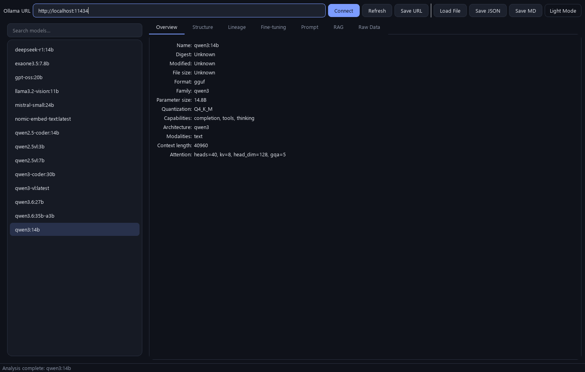
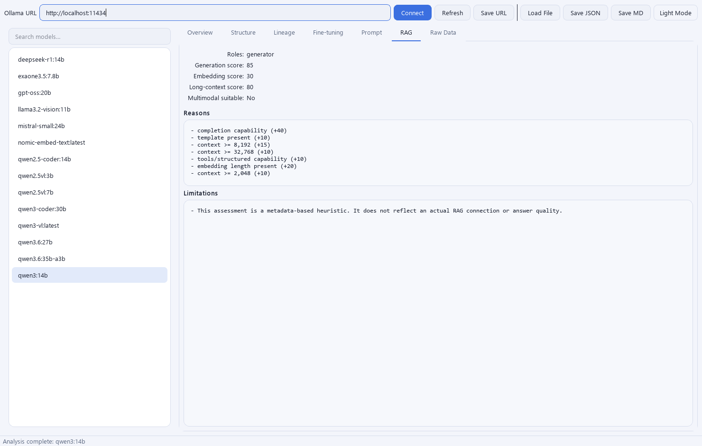

# Ollama Model & RAG Inspector

A read-only desktop GUI (PySide6) that inspects models registered on an
[Ollama](https://ollama.com) server — and external GGUF/Modelfile files on disk —
reporting basic info, architecture metadata, Modelfile configuration, model
lineage, fine-tuning traces, and RAG role-suitability. Every conclusion is
**evidence-based, never guessed**.


## Highlights

- **Read-only & safe.** No pull/create/delete/copy, no Modelfile edits, no
  inference. Only `/api/tags`, `/api/show`, and optionally `/api/ps` are called.
- **Generic.** No model name is hardcoded; unknown architectures still show raw
  metadata and any structural values that can be discovered.
- **Evidence-based.** Every fact is labeled `Confirmed` / `Derived` / `Detected`
  / `Declared` / `Unknown` / `Conflict`. Unverifiable details stay `Unknown`.
- **External models.** Inspect a local `.gguf` file (GGUF metadata is parsed in
  pure Python — no weights loaded) or a Modelfile, using the same analyzers.
- **Modern UI.** Sleek dark theme with a **dark/light toggle**, tuned for Full HD.
- **Reports.** Export JSON and Markdown inspection reports.
- **No heavy deps.** No `torch`/`transformers`/`langchain`; just PySide6, httpx,
  and pydantic.

## Screenshots

Connected to a live Ollama server (14 models). Left: the **Overview** tab in the
dark theme (`qwen3:14b` metadata). Right: the **RAG** tab in the light theme
(role-suitability scores with reasons) — toggle themes from the top-right button.

| Overview — dark theme | RAG — light theme |
|:---:|:---:|
|  |  |

## Requirements

- Python 3.11+
- An Ollama server to inspect (default `http://localhost:11434`), and/or local
  `.gguf` / Modelfile files.

## Install & run

### Windows (batch helpers)

```bat
setup.bat   :: create .venv and install the app + dev tools
run.bat     :: launch the GUI (auto-runs setup.bat if needed)
test.bat    :: run pytest + ruff headless
```

### Manual (any OS)

```bash
python -m venv .venv
# Windows PowerShell: .venv\Scripts\Activate.ps1
# bash:               source .venv/bin/activate
pip install -e ".[dev]"

# run
ollama-inspector
# or:  python -m ollama_inspector.main
# or without installing:  PYTHONPATH=src python -m ollama_inspector.main
```

## Usage

1. Confirm/edit the Ollama URL and click **Connect**.
2. Pick a model from the left list (the search box filters by name).
3. Browse the tabs: **Overview / Structure / Lineage / Fine-tuning / Prompt /
   RAG / Raw Data**.
4. Save a report with **Save JSON** or **Save MD**.

**External / local models:** click **Load File** to inspect a `.gguf` file, a
Modelfile, or a folder containing either. **Theme:** use the top-right
**Dark Mode / Light Mode** button; the choice is remembered.

The UI never freezes — all HTTP and analysis run on a `QThreadPool`, and a
request-ID guard discards stale results when you switch models quickly.

## Build a standalone .exe (Windows)

```bat
build_exe.bat            :: generates the icon and builds dist\OllamaInspector.exe
```

This uses PyInstaller. Two specs are provided:

- `OllamaInspector.spec` — single-file `.exe` (used by `build_exe.bat`).
- `OllamaInspector-onedir.spec` — a folder build where the Qt libraries are
  separate files (the **LGPL-friendly** layout, recommended for redistribution):
  `python -m PyInstaller --noconfirm OllamaInspector-onedir.spec`.

**Note:** the bundled executable includes Qt, used under the **LGPL-3.0**;
distributing it carries LGPL obligations. See
[THIRD_PARTY_LICENSES.md](THIRD_PARTY_LICENSES.md) before redistributing binaries.

## Documentation

- [User Manual (PDF)](docs/UserManual.pdf) — end-user guide (regenerate with
  `python packaging/gen_manual.py`).
- [docs/ARCHITECTURE.md](docs/ARCHITECTURE.md) — design, data flow, analysis logic.

## Tests & lint

```bash
# unit + UI tests (UI tests run headless via the offscreen platform)
QT_QPA_PLATFORM=offscreen PYTHONPATH=src python -m pytest -q

# lint
python -m ruff check src tests
```

Analyzers are pure Python and Qt-free, so the analysis layer is fully testable
without a running Ollama server (fixtures + a mocked HTTP transport).

## Project layout & design

See [docs/ARCHITECTURE.md](docs/ARCHITECTURE.md) for the layered design,
data flow, and analysis logic. In short:

```
src/ollama_inspector/
├── config/           static config & QSettings keys
├── domain/           Pydantic models + enums + errors        (no Qt)
├── infrastructure/   OllamaClient (httpx), GGUF reader, settings, export
├── analyzers/        Modelfile / architecture / metadata-tree /
│                     lineage / fine-tuning / RAG              (pure Python, no Qt)
├── services/         catalog / analysis / local-file / export orchestration
├── ui/               PySide6 window, workers, list model, tabs, widgets, theme
├── utils/            logging, url/filename helpers
├── app.py            QApplication bootstrap
└── main.py           entry point
```

## Scope

Primary data source is the Ollama HTTP API. For external files, GGUF **metadata**
(header + KV) is read directly. It does **not** read GGUF tensors/weights, access
Ollama manifests/blobs, run inference, or evaluate answer quality.

## Contributing

Contributions are welcome — see [CONTRIBUTING.md](CONTRIBUTING.md).

## License

[MIT](LICENSE) for this project's own code. Bundled/third-party components keep
their own licenses — notably **PySide6/Qt (LGPL-3.0)**; see
[THIRD_PARTY_LICENSES.md](THIRD_PARTY_LICENSES.md).
